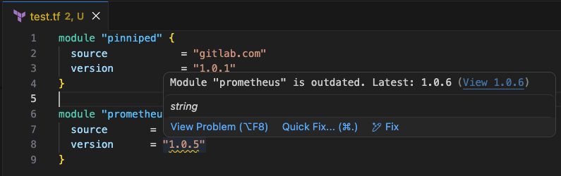

# GitLab Terraform Module Version Checker



[VS Code Marketplace](https://marketplace.visualstudio.com/items?itemName=KevinAnadon.gitlab-tfmodule-version-checker)

A VS Code extension designed to help teams keep Terraform modules up to date by validating their versions against the GitLab Terraform Module Registry.

This project is structured as a clean, modular, and maintainable extension following VS Code best practices and GitLab’s official Terraform Module Registry API.

---

## 📦 Project Structure
```
.
├── assets/
│   └── gitlab-tfmodule-version-checker.png  # Extension icon & output screenshot
├── src/                                      # Source code (TypeScript)
│   ├── extension.ts
│   ├── terraformParser.ts
│   ├── gitlabClient.ts
│   ├── versionService.ts
│   ├── cache.ts
│   └── test/
│       ├── index.ts
│       ├── cache.test.ts
│       ├── gitlabClient.test.ts
│       ├── terraformParser.test.ts
│       └── versionService.test.ts
├── .vscode-test.mjs
├── .vscodeignore
├── eslint.config.mjs
├── package.json
├── README.md
└── tsconfig.json
```

---

## 🏗 Architectural Overview

The extension follows a layered structure:

- **Command & UI Layer** → `extension.ts`
- **Parsing Layer** → `terraformParser.ts`
- **API Layer** → `gitlabClient.ts`
- **Business Logic Layer** → `versionService.ts`
- **Caching Layer** → `cache.ts`

Each file has a clearly defined responsibility to keep the project maintainable and extensible.

---

## 📂 Source Directory (`src/`)

### `extension.ts`

Entry point of the extension.

Responsibilities:

- Registers VS Code commands:
  - `gitlab-tfmodule-version-checker.checkVersions`
  - `gitlab-tfmodule-version-checker.setToken`
  - `gitlab-tfmodule-version-checker.clearToken`
  - `gitlab-tfmodule-version-checker.setGitlabUrl`
- Reads the active Terraform file
- Orchestrates module detection and version validation
- Creates inline diagnostics for outdated modules
- Generates clickable links to GitLab tag pages
- Manages secure token storage via SecretStorage

This file coordinates the entire workflow but does not contain parsing or API logic.

---

### `terraformParser.ts`

Responsible for extracting Terraform module blocks from the active file.

It:

- Identifies `module` blocks
- Extracts:
  - Module name
  - Source
  - Version
- Tracks exact position of version values for inline highlighting

This layer isolates Terraform parsing from the rest of the system.

---

### `gitlabClient.ts`

Handles communication with GitLab’s Terraform Module Registry API.

Uses:
GET /api/v4/packages/terraform/modules/v1/:namespace/:module/:system
plain text

Responsibilities:

- Extract namespace/module/system from Terraform source
- Authenticate using Bearer token
- Retrieve latest published module version
- Return the authoritative GitLab project URL
- Normalize version values (e.g., strip leading `v`)

This file contains no VS Code logic — only API interaction.

---

### `versionService.ts`

Encapsulates semantic version comparison.

Uses `semver` to determine:

- Whether a module version is valid
- Whether a module is outdated

This ensures clean separation between API retrieval and business logic.

---

### `cache.ts`

Provides a simple in-memory cache to reduce unnecessary API calls.

Features:

- TTL-based expiration (5 minutes)
- Keyed by module source
- Stores latest known version
- Improves performance when checking multiple modules

This keeps network overhead minimal while preserving responsiveness.

---

## 🔐 Security Model

Authentication is handled using:

- VS Code **SecretStorage**
- OS-level encrypted credential storage
- Bearer token authentication

Tokens are:

- Never stored in `settings.json`
- Never logged
- Never exposed to other extensions

The GitLab URL is stored in VS Code's `settings.json` (not SecretStorage) as it is not sensitive. It defaults to `https://gitlab.com` and can be changed via the `setGitlabUrl` command or directly in settings.

---

## 🔄 Execution Flow

1. User runs the check command.
2. If no token is stored, a first-use setup flow is triggered:
   - Prompts for GitLab URL (pre-filled with `https://gitlab.com`, Enter keeps the default)
   - Prompts for a GitLab Personal Access Token (required — aborts if skipped)
3. Active Terraform file is parsed.
4. Each module is validated against GitLab registry.
5. Latest version is retrieved.
6. Semantic comparison is performed.
7. Outdated modules receive inline warnings.
8. Clicking the diagnostic opens the GitLab tag page.

All operations run only on demand — no background scanning.

---

## ⚡ Performance Characteristics

- Active-file only scanning
- Parallel API requests per module
- In-memory caching
- No third-party HTTP libraries
- No background watchers
- Minimal runtime overhead

---

## 🧠 Design Principles

- Separation of concerns
- Registry-first version validation
- No assumptions about GitLab project structure
- Support for nested GitLab subgroups
- Minimal dependencies
- Secure by default
- Clean extensibility for future features

---

## 🚀 Extensibility

The current structure allows easy future expansion, such as:

- Auto-update Quick Fix actions
- Workspace-wide scanning
- Compare-view links between versions
- Changelog previews
- Persistent cache storage

The architecture supports these enhancements without structural refactoring.

---

## 📦 Dependencies

| Package | Type | Purpose |
|---------|------|---------|
| `semver` | runtime | Semantic version parsing and comparison |
| `typescript` | dev | TypeScript compiler |
| `eslint` | dev | Linting |
| `@types/vscode` | dev | VS Code API type definitions |
| `@types/semver` | dev | Type definitions for semver |
| `@vscode/test-cli` | dev | Extension test runner CLI |
| `@vscode/test-electron` | dev | Extension test runner (Electron) |

---

## 🧪 Running Tests

Compile and run all tests:

```bash
npm test
```

Test coverage:

| File | Tests |
|------|-------|
| `terraformParser.ts` | Module extraction, position tracking, edge cases |
| `versionService.ts` | Semver comparisons, invalid versions |
| `cache.ts` | TTL expiry, key lookup, overwrite |
| `gitlabClient.ts` | Mocked GitLab API responses, error handling |

---

## ✅ Summary

This extension provides a clean, modular, and registry-aware way to validate Terraform module versions inside VS Code.

It is:

- Structured
- Secure
- Performant
- Subgroup-aware
- Registry-compliant
- Easy to extend

Built for Terraform governance and GitLab-based module management workflows.